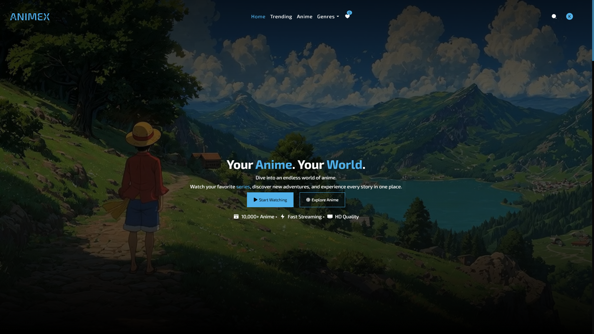
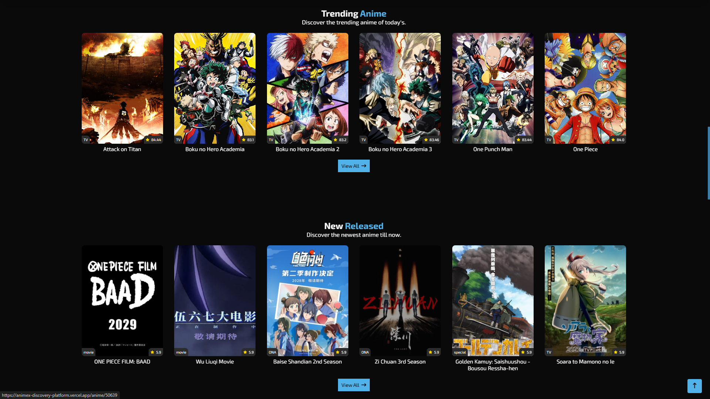
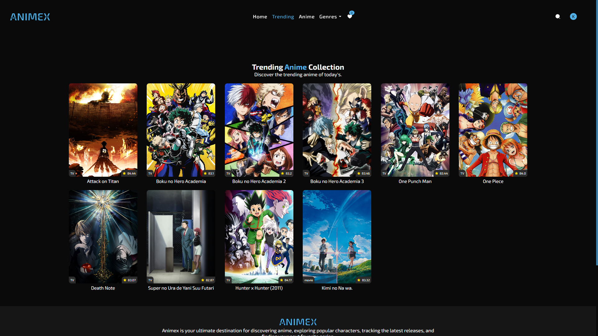
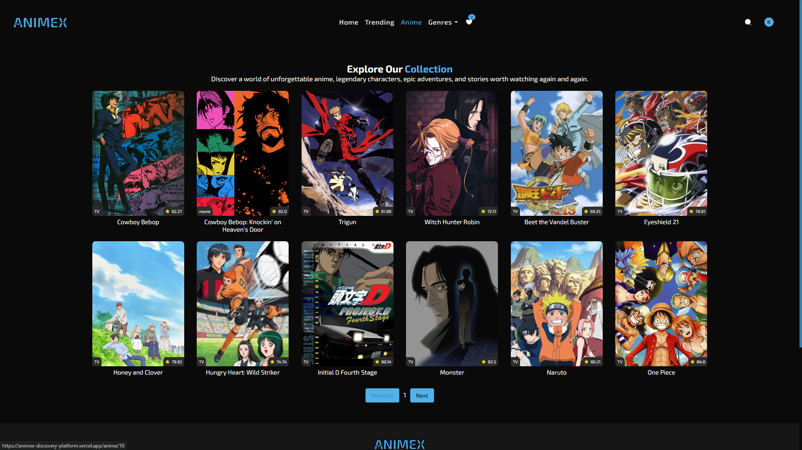
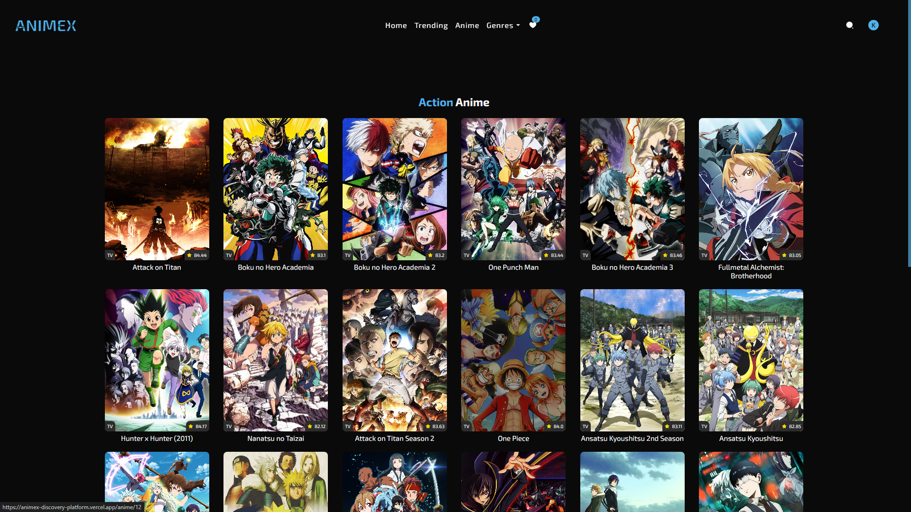
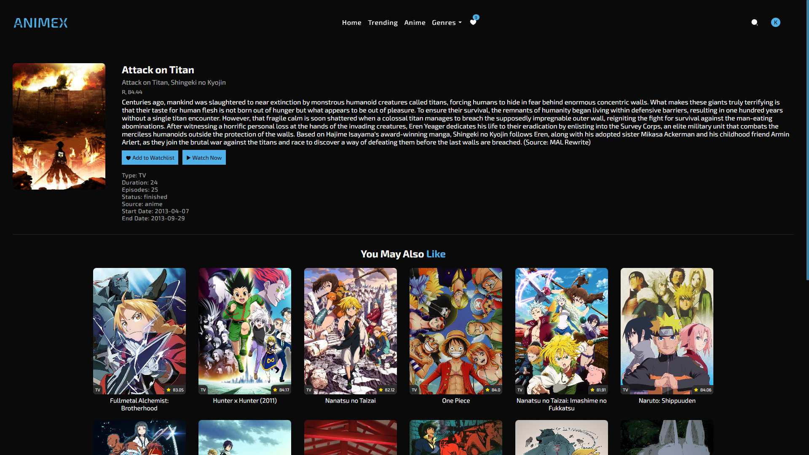
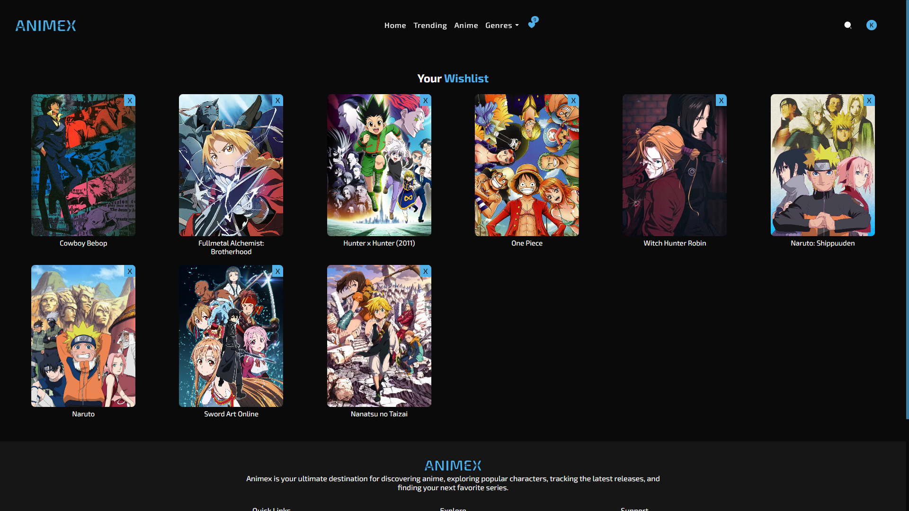
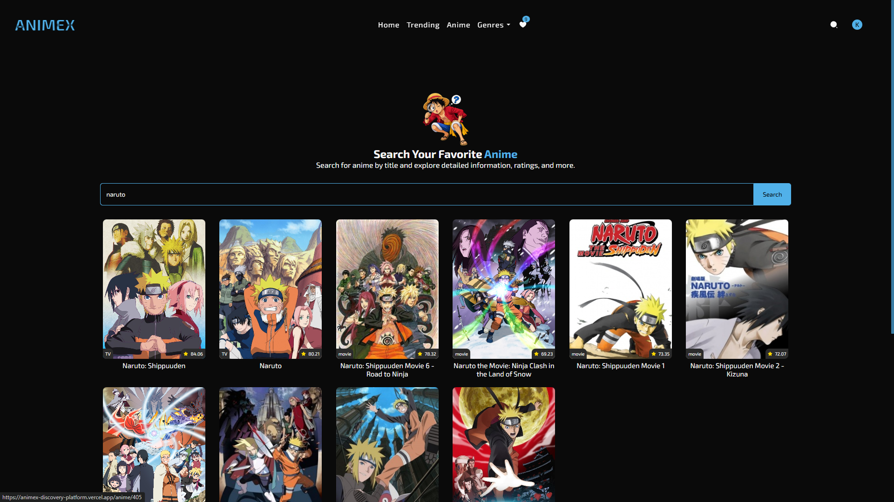
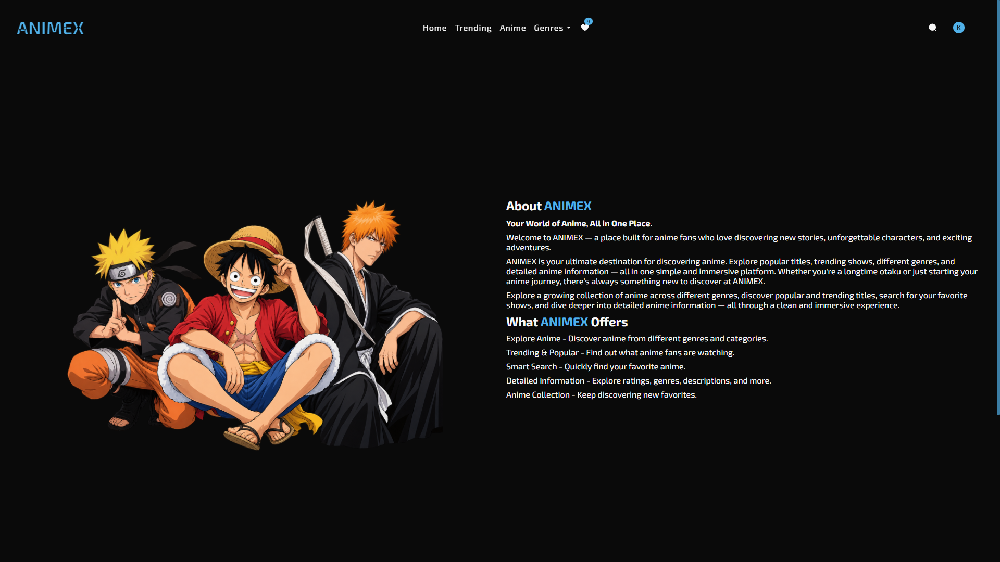
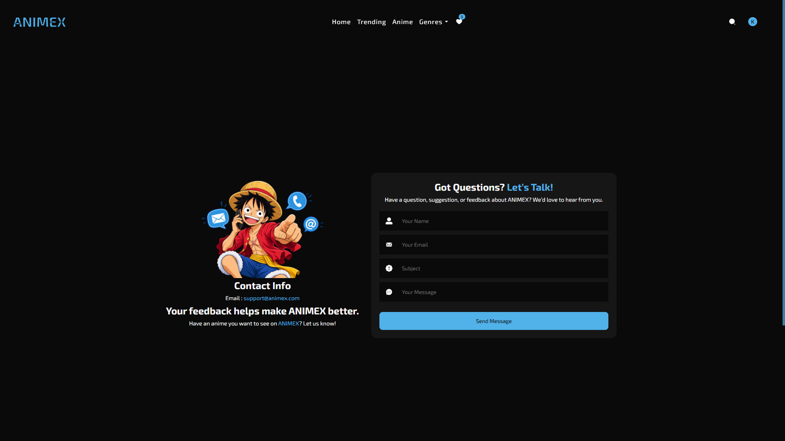

# ANIMEX — Anime Discovery Platform

ANIMEX is a modern, responsive anime discovery platform built with React and Node.js. It allows users to explore anime, search for titles, browse genres, view detailed anime information, discover related anime, and save their favorite anime to a wishlist.
The platform uses the Kitsu API to fetch anime data dynamically and provides a clean, futuristic interface designed for anime fans.


## 🛠️ Tech Stack

### Frontend
- React.js
- Vite
- JavaScript
- Axios
- React Router DOM

### Backend
- Node.js
- Express.js
- MongoDB
- Mongoose

### API
- Kitsu API

### Security & Middleware
- CORS
- dotenv

### Deployment
- Frontend: Vercel
- Backend: Render
- Database: MongoDB Atlas

### API Integration
ANIMEX uses the Kitsu API to dynamically retrieve anime information.
The application uses API endpoints for features such as:
- Anime discovery
- Anime search
- Anime details
- Genre-based anime
- Related anime
- Popular anime
- Anime metadata

### Kitsu API:
- https://kitsu.io/api/edge/

## 🍽️ About The Project

ANIMEX is a modern and responsive Anime Discovery Platform built to provide users with a smooth and engaging way to explore the world of anime.

The platform uses the Kitsu API to fetch anime data dynamically, allowing users to discover popular anime, browse genres, search for specific titles, view detailed anime information, and explore related anime.

ANIMEX also includes a wishlist feature, responsive layouts, dynamic routing, loading states, and a clean futuristic UI designed specifically for anime enthusiasts.

The project follows a separate frontend and backend architecture, with the frontend built using React + Vite and the backend powered by Node.js + Express + MongoDB. The application is deployed using Vercel for the frontend and Render for the backend.

This project was developed as a full-stack portfolio project to demonstrate practical skills in modern React development, REST API integration, backend development, database management, responsive design, and deployment.

### ✨ Key Highlights:
- Anime Discovery — Explore a wide range of anime with dynamically fetched data.
- Powerful Search — Search anime by title and get results instantly.
- Genre-Based Browsing — Discover anime across multiple genres.
- Detailed Anime Pages — View posters, descriptions, ratings, release information, and more.
- Wishlist — Save favorite anime and easily remove them whenever needed.
- Dynamic API Integration — Real-time anime data powered by the Kitsu API.
- Client-Side Routing — Smooth navigation using React Router.
- Toast Notifications — User-friendly feedback for actions such as login, cart updates, and subscriptions.
- Fully Responsive — Optimized for desktop, laptop, tablet, and mobile devices.
- Loading & Empty States — User-friendly feedback while data is loading or unavailable.
- Modern UI — Futuristic anime-inspired interface with a clean blue-and-white visual style.
- Full-Stack Architecture — Separate React frontend and Node.js/Express backend.
- MongoDB Integration — Backend database integration using Mongoose.
- Production Deployment — Frontend deployed on Vercel and backend on Render.


## ⚙️ Installation & Setup

### 1. Clone the repository

```
git clone https://github.com/abdullah-full-stack-dev/animex-anime-streaming.git
cd animex-anime-streaming
```

---

### 2. Install dependencies

#### Frontend

```
cd Frontend
npm install
npm run dev
```

#### Backend

```
cd Backend
npm install
npm start
```

## 🔐 Environment Variables

Create a `.env` file in the Backend folder:

```
PORT=5000
MONGO_URI=your_mongodb_connection
JWT_SECRET=your_secret_key
SMTP_HOST=your_smtp_host
SMTP_PORT=your_smtp_port
SMTP_USER=your_smtp_user
SMTP_KEY=your_smtp_key
MAIL_FROM=your_email
MAIL_FROM_NAME=your_name
```

---

## 🌐 Live Demo

👉 https://animex-discovery-platform.vercel.app/

---

## 📸 Screenshots

### Home Page


### home anime cards Page


### Trending Page


### Collection Page


### Genre Page


### Anime Detail Page


### Wishlist Page


### Search Page


### About Page


### Contact Page


---

## 👨‍💻 Author

* Abdullah Khan (Full Stack Web Developer)

---

## ⭐ Support

If you like this project, give it a ⭐ on GitHub!

---
